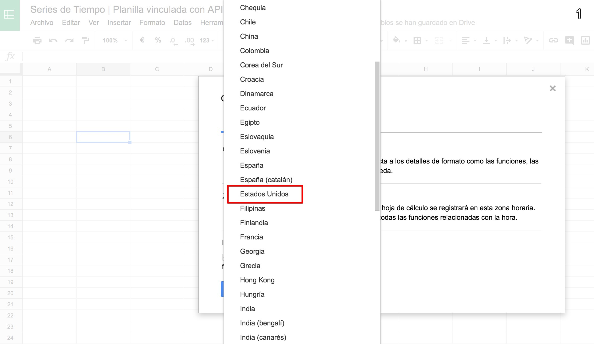
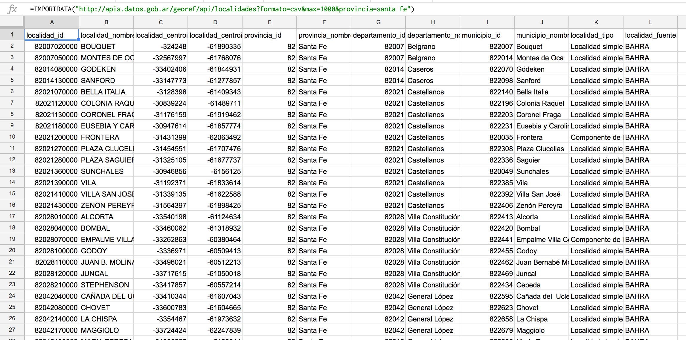
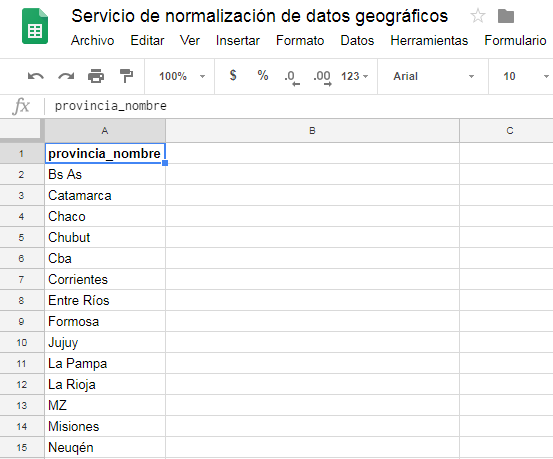
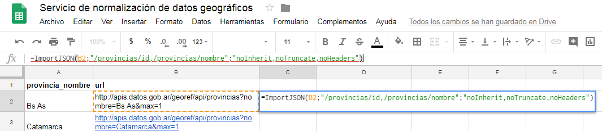
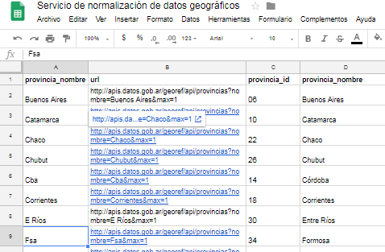

# Integración con planillas de cálculo

## Google Drive

### 1. Modificar la configuración regional

La API genera archivos CSV usando “.” como separador decimal. Para que Google Spreadsheet lea correctamente el archivo debe elegirse “Estados Unidos” o cualquier otra región compatible (esto sólo afecta a la lectura de coordenadas).

  

  

### 2. Importar listados de unidades territoriales

Utilizamos la función `IMPORTDATA()` de Google Sheets y armamos la url de la entidad territorial que queremos importar. Por ejemplo "localidades de la provincia de Santa Fé":

[`https://apis.datos.gob.ar/georef/api/localidades?formato=csv&max=1000&provincia=santa%20fe`](https://apis.datos.gob.ar/georef/api/localidades?formato=csv&max=1000&provincia=santa%20fe)

  

y obtendremos:

  

### 3. Normalizar un listado de unidades territoriales

Si tenemos un listado de provincias que queremos normalizar, como el siguiente:

  

Podemos armar urls individuales para normalizar los nombres y traer alguno de sus atributos. Imaginemos que queremos el ID y el nombre normalizado.

Primero generamos la url para cada una de las provincias:

  

y luego necesitamos importar una nueva función en la hoja de cálculo. Para eso, desde el menú:

1. Herramientas → Editor de secuencia de comandos.
2. Borramos todo lo que hay en el editor y pegamos el siguiente [script](https://raw.githubusercontent.com/bradjasper/ImportJSON/master/ImportJSON.gs) de [Bradjasper](https://github.com/bradjasper).
3. Renombremos el script como ImportJson.gs y guardamos.
4. Ahora ya podemos usar la función `=importJSON()` en una celda.

  

`=ImportJSON(B2;”/provincias/id,/provincias/nombre”;”noInherit,noTruncate,noHeaders”)`

y obtendremos:

  

